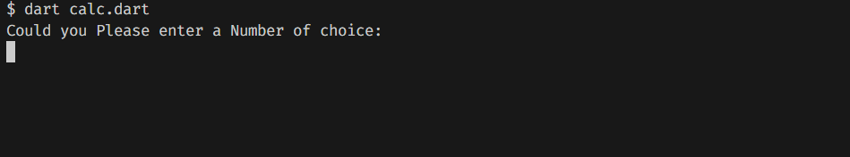
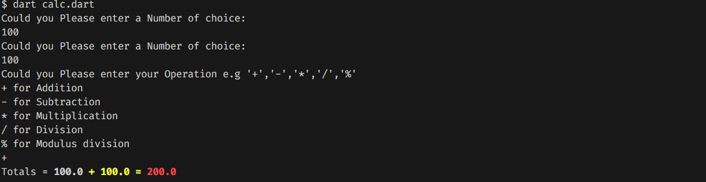
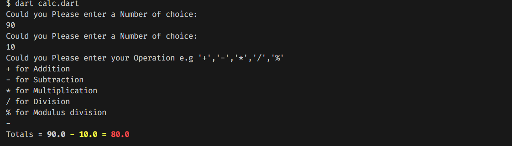
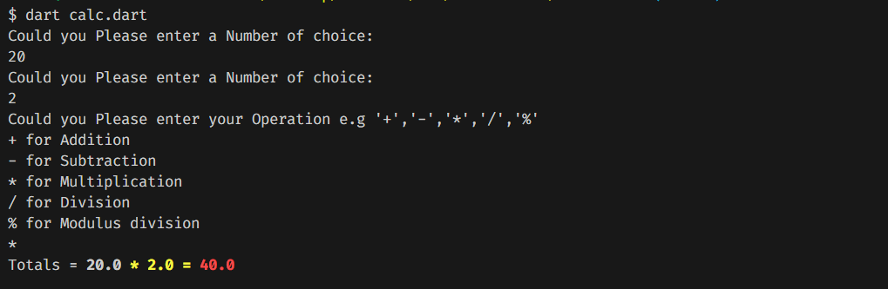
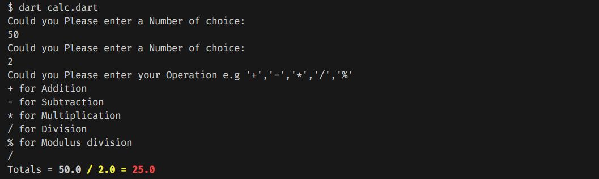
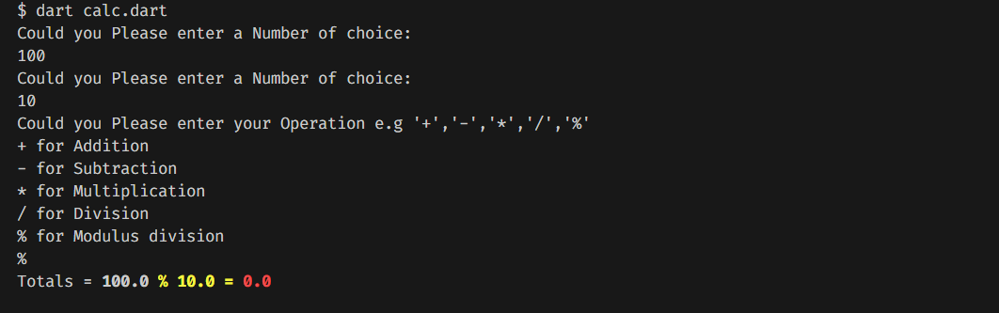

## calculator_dart
This project is used to practice the following concepts

- Composing basic app setup
- Creating basic mathematical functions in Dart
- Receive input from the User

- Conditionals and switch statements
- The basics of typecasting
- Implementing recursion

## Output
**Addition**

**Subtraction**

**Multiplication**

**Division**

**Modulus**

